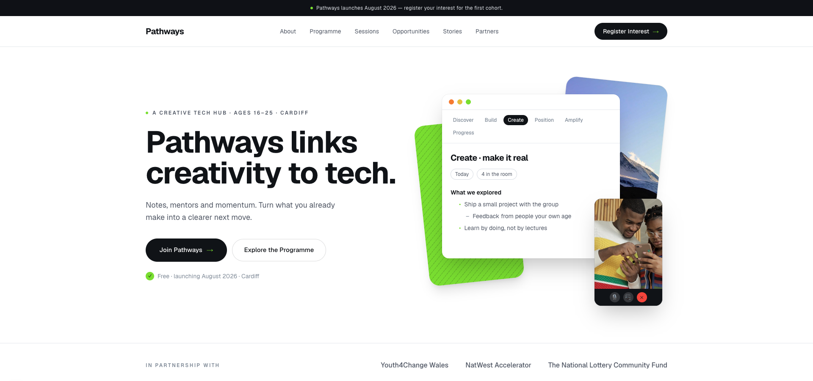

# Pathways

The website for Pathways, a creative tech hub for young people aged 16 to 25 in Cardiff. Pathways is a 12-month programme delivered by Youth4Change Wales and funded by The National Lottery Community Fund. It connects creativity with technology through six collaborative monthly sessions followed by six months of mentoring, check-ins and progression support.

I was commissioned to design and build the site as a freelance project, working from the client's content guide and visual brief through to a production launch in August 2026.

## About the project

Pathways is not a coding bootcamp. The programme helps young people who already create things (music, content, design, small businesses, community projects) understand how technology and enterprise can strengthen what they do and turn it into a clearer direction. The website has to carry that positioning: professional without feeling corporate, youth-aware without forcing it, and warm enough that a 17-year-old with no tech background feels like it was built for them.

The brief also demands that the site grow with the programme. Sessions, participant stories, opportunities and testimonials don't exist yet at launch, so every dynamic section is designed into the system from day one and stays hidden until there is real content to show.

## Scope

The full site covers:

- **Home**, introducing the programme with a video hero, the four-stage participant journey (Discover, Build, Position, Progress), programme stats and a live "latest from Pathways" feed
- **About**, the story of why Pathways exists and what makes it different from classroom-style provision
- **Programme**, the two-phase structure of six core sessions plus six months of progression support
- **Sessions**, a filterable archive where each session gets its own page with takeaways, facilitator profile, photography and resources
- **Opportunities**, a categorised board of jobs, internships, grants, training and events, with featured picks and deadline tracking
- **Stories**, a journal documenting the programme through articles, photography and film
- **Partners**, partnership routes for mentors, employers and funders
- **Join Pathways**, eligibility information and the registration form with safeguarding-aware data handling
- **Contact**, plus safeguarding, privacy and accessibility pages

Everything editorial (sessions, stories, opportunities, facilitators, testimonials, the announcement bar) is content-managed so the Pathways team can update the site without a developer.

## Design process

Rather than presenting static mockups, I built two complete homepage directions as working prototypes and let the client review them in the browser:

- **Sample A** follows a clean, structured direction with alternating light and dark blocks, numbered service cards and animated stat counters
- **Sample B** blends that structure with a parallax philosophy film, staggered scroll animations and a warmer editorial serif treatment

Both run on a strict five-colour brand system (Midnight, Panel, Soft Grey, Electric Lime, Warm Orange) and use the client's real photography and film.

## Tech stack

Built with Next.js 16 (App Router), React 19, TypeScript and Tailwind CSS 4.

## Running locally

```bash
npm install
npm run dev
```

Then open [http://localhost:3000](http://localhost:3000). The root page links to both homepage prototypes.

## Status

In active development. The launch build focuses on Home, About, Programme, Join Pathways, Partners and Contact, with the Sessions, Stories and Opportunities sections growing as the programme begins delivery. Pathways launches August 2026.
